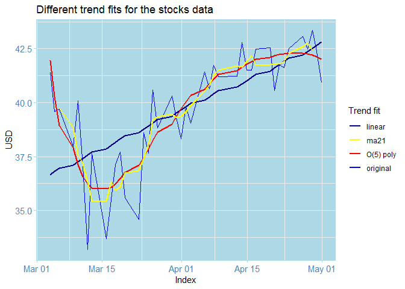

# Stock_market_prediction
A repository with examples on using ARIMA models for stocks analysis and prediction. 

## DISCLAIMER
The author of this repository is not, in any way, liable to any use of this code. The repository and all its content are meant to be an educational guide on Time Series Analaysis, and should not be used for real stock trade. Please consult a finance professional and educate yourself if you wish to perform stock trade, at your own risk. 
