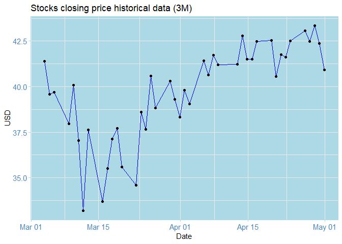
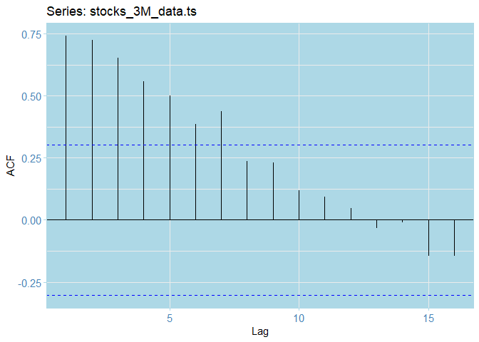
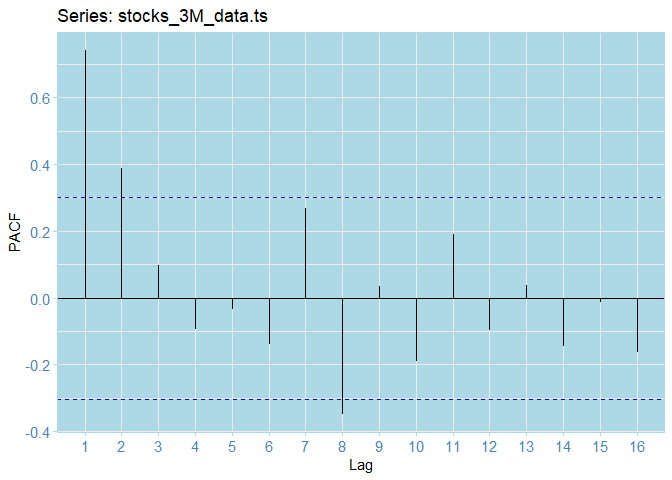

#  Historical Stocks Data Anlaysis: Forecasting Closing Prices

## Loading packages


```r
library(tidyverse)
library(tidyquant)
library(gridExtra)
library(tibbletime)
library(forecast)
library(itsmr)
library(here)
library(bbmle)
library(tseries)
library(fpp2)
library(ggthemes)
library(readr)
library(xts)
library(reshape)
require(timeDate)
library(png)
knitr::opts_chunk$set(comment=NA,tidy=TRUE)
```


## Loading the data 


```r
stocks_3M <- read_csv("../data_raw/stocks_data_3M.csv")
```

```
Parsed with column specification:
cols(
  Date = col_date(format = ""),
  Open = col_double(),
  High = col_double(),
  Low = col_double(),
  Close = col_double(),
  `Adj Close` = col_double(),
  Volume = col_double()
)
```

```r
head(stocks_3M, 10)
```

```
# A tibble: 10 x 7
   Date        Open  High   Low Close `Adj Close`   Volume
   <date>     <dbl> <dbl> <dbl> <dbl>       <dbl>    <dbl>
 1 2020-03-04  40.7  41.5  39.8  41.4        41.0 30022100
 2 2020-03-05  40.2  40.5  39.3  39.6        39.2 30255900
 3 2020-03-06  38    40.0  37.8  39.7        39.3 48605600
 4 2020-03-09  36.9  39.6  36.3  38.0        37.6 61535300
 5 2020-03-10  39.2  40.2  37.9  40.1        39.7 50536500
 6 2020-03-11  39.0  39.2  36.4  37.0        36.7 63594300
 7 2020-03-12  34.5  35.8  33    33.2        32.9 51855300
 8 2020-03-13  35.2  37.7  33.3  37.6        37.3 53859600
 9 2020-03-16  33.2  37.0  32.4  33.7        33.4 44211300
10 2020-03-17  34.7  36.2  33.6  35.5        35.2 41572400
```

## Data Preprocessing

Next, extract the columns of interest and convert into time series objects


```r
stocks_3M_data <- select(stocks_3M, Date, Close) # extract cols 
dates <- as.POSIXct.Date(stocks_3M_data$Date) # extract dates in POSIXct format
stocks_3M_data.ts <- xts(stocks_3M_data$Close, 
                        order.by = dates) # 7600
str(stocks_3M_data.ts) # inspect the data
```

```
An 'xts' object on 2020-03-03 19:00:00/2020-04-30 20:00:00 containing:
  Data: num [1:42, 1] 41.4 39.6 39.7 38 40.1 ...
  Indexed by objects of class: [POSIXct,POSIXt] TZ: 
  xts Attributes:  
 NULL
```

## Inspecting the data


## Autoplot, ACF and PACF


```r
# Plot the same white noice this time as lines  
autoplot(stocks_3M_data.ts) + 
  geom_line(colour="blue")  +
  ggtitle("Stocks closing price historical data (3M)") + 
  theme_stonks() + xlab("Date") + ylab("USD") + geom_point(color="black")
```

<!-- -->


```r
# ACF
ggAcf(stocks_3M_data.ts) + theme_stonks()
```

<!-- -->


```r
# PACF 
ggPacf(stocks_3M_data.ts) + theme_stonks()
```

<!-- -->


## Estimating the trend 


```r
# Estimate various trends
stocks_3M_linear <- tslm(ts(stocks_3M_data.ts)~trend)  
stocks_3M_p4 <- tslm(ts(stocks_3M_data.ts)~trend + I(trend^2) + I(trend^3) + I(trend^4) + I(trend^5) ) # polynomial
stocks_3M_ma21 <- ma(ts(stocks_3M_data.ts), order=5) # moving average
stocks_3M_trends <- data.frame(cbind(Data=stocks_3M_data.ts, 
                        Linear_trend=fitted(stocks_3M_linear),
                        Poly_trend=fitted(stocks_3M_p4),
                        Moving_avg5 = stocks_3M_ma21
                        ))

# transform to xts objects
stocks_3M_linear <- xts(fitted(stocks_3M_linear), order.by = dates)
stocks_3M_p4 <- xts(fitted(stocks_3M_p4), order.by = dates)

# Plot all the trends together 
autoplot(stocks_3M_data.ts, colour="original") + theme_stonks() + 
  geom_line(aes(y=stocks_3M_linear, color="linear"),size=1) + 
  geom_line(aes(y=stocks_3M_p4, color = "O(5) poly"), size=1) + 
  geom_line(aes(y=stocks_3M_ma21, color ="ma21"), size=1)  + 
  scale_color_manual(values = c('original'= 'blue', 
                                'linear' = 'darkblue',
                                'O(5) poly' = 'red', 
                                'ma21'= 'yellow')) + 
  labs(color = 'Trend fit') +  ylab("USD") + 
  ggtitle("Different trend fits for the stocks data") 
```

```
Warning: Removed 4 row(s) containing missing values (geom_path).
```

<!-- -->


