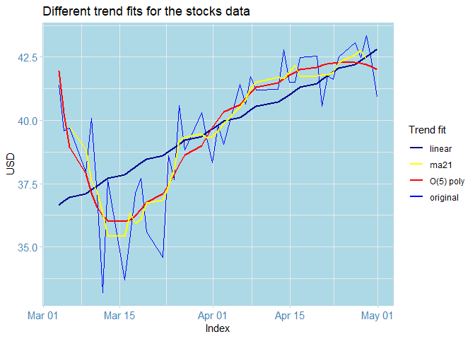
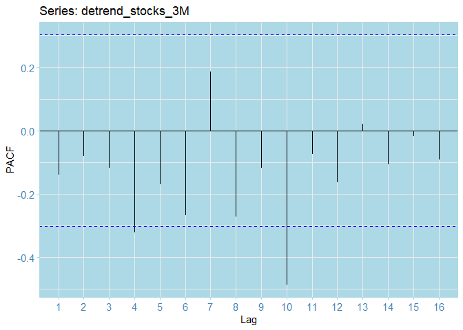

#  Historical Stocks Data Anlaysis: Forecasting Closing Prices

## Loading packages


```r
library(tidyverse)
library(tidyquant)
library(gridExtra)
library(tibbletime)
library(forecast)
library(itsmr)
library(here)
library(bbmle)
library(tseries)
library(fpp2)
library(ggthemes)
library(readr)
library(xts)
library(reshape)
require(timeDate)
library(png)
knitr::opts_chunk$set(comment=NA,tidy=TRUE)
```


## Loading the data 


```r
stocks_3M <- read_csv("../data_raw/stocks_data_3M.csv")
```

```
Parsed with column specification:
cols(
  Date = col_date(format = ""),
  Open = col_double(),
  High = col_double(),
  Low = col_double(),
  Close = col_double(),
  `Adj Close` = col_double(),
  Volume = col_double()
)
```

```r
head(stocks_3M, 10)
```

```
# A tibble: 10 x 7
   Date        Open  High   Low Close `Adj Close`   Volume
   <date>     <dbl> <dbl> <dbl> <dbl>       <dbl>    <dbl>
 1 2020-03-04  40.7  41.5  39.8  41.4        41.0 30022100
 2 2020-03-05  40.2  40.5  39.3  39.6        39.2 30255900
 3 2020-03-06  38    40.0  37.8  39.7        39.3 48605600
 4 2020-03-09  36.9  39.6  36.3  38.0        37.6 61535300
 5 2020-03-10  39.2  40.2  37.9  40.1        39.7 50536500
 6 2020-03-11  39.0  39.2  36.4  37.0        36.7 63594300
 7 2020-03-12  34.5  35.8  33    33.2        32.9 51855300
 8 2020-03-13  35.2  37.7  33.3  37.6        37.3 53859600
 9 2020-03-16  33.2  37.0  32.4  33.7        33.4 44211300
10 2020-03-17  34.7  36.2  33.6  35.5        35.2 41572400
```

## Data Preprocessing

Next, extract the columns of interest and convert into time series objects


```r
stocks_3M_data <- select(stocks_3M, Date, Close) # extract cols 
dates <- as.POSIXct.Date(stocks_3M_data$Date) # extract dates in POSIXct format
stocks_3M_data.ts <- xts(stocks_3M_data$Close, 
                        order.by = dates) # 7600
str(stocks_3M_data.ts) # inspect the data
```

```
An 'xts' object on 2020-03-03 19:00:00/2020-04-30 20:00:00 containing:
  Data: num [1:42, 1] 41.4 39.6 39.7 38 40.1 ...
  Indexed by objects of class: [POSIXct,POSIXt] TZ: 
  xts Attributes:  
 NULL
```

## Inspecting the data


## Autoplot, ACF and PACF


```r
# Plot the same white noice this time as lines  
autoplot(stocks_3M_data.ts) + 
  geom_line(colour="blue")  +
  ggtitle("Stocks closing price historical data (3M)") + 
  theme_stonks() + xlab("Date") + ylab("USD") + geom_point(color="black")
```

<!-- -->


```r
# ACF
ggAcf(stocks_3M_data.ts) + theme_stonks()
```

<!-- -->


```r
# PACF 
ggPacf(stocks_3M_data.ts) + theme_stonks()
```

<!-- -->


## Estimating the trend 


```r
# Estimate various trends
stocks_3M_linear <- tslm(ts(stocks_3M_data.ts)~trend)  
stocks_3M_p5 <- tslm(ts(stocks_3M_data.ts)~trend + I(trend^2) + I(trend^3) + I(trend^4) + I(trend^5) ) # polynomial
stocks_3M_ma5 <- ma(ts(stocks_3M_data.ts), order=5) # moving average
stocks_3M_trends <- data.frame(cbind(Data=stocks_3M_data.ts,  # stack in a dataframe
                        Linear_trend=fitted(stocks_3M_linear),
                        Poly_trend=fitted(stocks_3M_p5),
                        Moving_avg5 = stocks_3M_ma5
                        ))

# transform to xts objects
stocks_3M_linear <- xts(fitted(stocks_3M_linear), order.by = dates)
stocks_3M_p5 <- xts(fitted(stocks_3M_p5), order.by = dates)

# Plot all the trends together 
autoplot(stocks_3M_data.ts, colour="original") + theme_stonks() + 
  geom_line(aes(y=stocks_3M_linear, color="linear"),size=1) + 
  geom_line(aes(y=stocks_3M_p5, color = "O(5) poly"), size=1) + 
  geom_line(aes(y=stocks_3M_ma5, color ="ma21"), size=1)  + 
  scale_color_manual(values = c('original'= 'blue', 
                                'linear' = 'darkblue',
                                'O(5) poly' = 'red', 
                                'ma21'= 'yellow')) + 
  labs(color = 'Trend fit') +  ylab("USD") + 
  ggtitle("Different trend fits for the stocks data") 
```

```
Warning: Removed 4 row(s) containing missing values (geom_path).
```

<!-- -->


```r
# Detrend and show the de-trended series
stocks_3M_ma21 <- xts(stocks_3M_p5,order.by = dates) # cast to xts 
detrend_stocks_3M <- stocks_3M_data.ts - stocks_3M_p5 # substract from original

# Plot the residuals
autoplot(detrend_stocks_3M) + theme_stonks() + 
  ggtitle("De-trended Data ( O(5) trend)") +
  geom_hline(yintercept = 0, colour="black") + 
  geom_point() + ylab("USD - trend")  + geom_line(color="blue")
```

<!-- -->

The residuals look zero-trended. 


```r
# ACF
ggAcf(detrend_stocks_3M) + theme_stonks() 
```

<!-- -->

The ACF lags all , except for one fall within the 0.25 confidence bounds. 


```r
# PACF 
ggPacf(detrend_stocks_3M) + theme_stonks() 
```

<!-- -->

The PACF residuals mostly fall within the confidence bounds; whoever there seems to be some negative autocorrelation present across lags. However, from all the previous, there doesn't seem to be a strong seasonal component present.

## Train-test split & ARIMA fitting

We will now split the data into 32 training data points and 10 test data points. We will produce predictions and compare them to assess fit.


```r
## train_test_split
detrend_stocks_3M_train <- stocks_3M_data.ts[1:(round(length(detrend_stocks_3M))-10)] # 32
detrend_stocks_3M_test <- stocks_3M_data.ts[(round(length(detrend_stocks_3M))-9):length(detrend_stocks_3M)] # 10
str(detrend_stocks_3M_train)
```

```
An 'xts' object on 2020-03-03 19:00:00/2020-04-16 20:00:00 containing:
  Data: num [1:32, 1] 41.4 39.6 39.7 38 40.1 ...
  Indexed by objects of class: [POSIXct,POSIXt] TZ: 
  xts Attributes:  
 NULL
```

```r
str(detrend_stocks_3M_test)
```

```
An 'xts' object on 2020-04-19 20:00:00/2020-04-30 20:00:00 containing:
  Data: num [1:10, 1] 42.5 40.5 41.8 41.6 42.5 ...
  Indexed by objects of class: [POSIXct,POSIXt] TZ: 
  xts Attributes:  
 NULL
```

```r
length(detrend_stocks_3M_train)
```

```
[1] 32
```

```r
length(detrend_stocks_3M_test)
```

```
[1] 10
```


```r
# Fit the ARIMA model on trian data
detrend_stocks_3M_arima_110 = auto.arima(detrend_stocks_3M_train,
                       seasonal=TRUE,
                       stepwise=FALSE,
                       max.d = 2, 
                       ic = c("aicc", "aic", "bic") , 
                       approximation=FALSE,
                       trace=TRUE)
```

```

 ARIMA(0,1,0)                    : 134.4715
 ARIMA(0,1,0) with drift         : 136.753
 ARIMA(0,1,1)                    : 128.4086
 ARIMA(0,1,1) with drift         : 130.7508
 ARIMA(0,1,2)                    : 129.5682
 ARIMA(0,1,2) with drift         : 132.1684
 ARIMA(0,1,3)                    : 132.2178
 ARIMA(0,1,3) with drift         : 135.0296
 ARIMA(0,1,4)                    : 134.9037
 ARIMA(0,1,4) with drift         : 137.877
 ARIMA(0,1,5)                    : Inf
 ARIMA(0,1,5) with drift         : Inf
 ARIMA(1,1,0)                    : 128.0794
 ARIMA(1,1,0) with drift         : 130.4957
 ARIMA(1,1,1)                    : 129.8294
 ARIMA(1,1,1) with drift         : 132.4015
 ARIMA(1,1,2)                    : 132.2178
 ARIMA(1,1,2) with drift         : 135.0353
 ARIMA(1,1,3)                    : 134.9886
 ARIMA(1,1,3) with drift         : 138.0829
 ARIMA(1,1,4)                    : Inf
 ARIMA(1,1,4) with drift         : Inf
 ARIMA(2,1,0)                    : 129.5882
 ARIMA(2,1,0) with drift         : 132.1668
 ARIMA(2,1,1)                    : Inf
 ARIMA(2,1,1) with drift         : Inf
 ARIMA(2,1,2)                    : 134.9701
 ARIMA(2,1,2) with drift         : 138.0537
 ARIMA(2,1,3)                    : Inf
 ARIMA(2,1,3) with drift         : Inf
 ARIMA(3,1,0)                    : 132.1147
 ARIMA(3,1,0) with drift         : 134.9255
 ARIMA(3,1,1)                    : 134.9128
 ARIMA(3,1,1) with drift         : 137.9894
 ARIMA(3,1,2)                    : Inf
 ARIMA(3,1,2) with drift         : Inf
 ARIMA(4,1,0)                    : 134.9736
 ARIMA(4,1,0) with drift         : 138.0206
 ARIMA(4,1,1)                    : Inf
 ARIMA(4,1,1) with drift         : 141.3562
 ARIMA(5,1,0)                    : 137.4053
 ARIMA(5,1,0) with drift         : 140.7549


 Best model: ARIMA(1,1,0)                    
```


```r
detrend_stocks_3M_arima_110
```

```
Series: detrend_stocks_3M_train 
ARIMA(1,1,0) 

Coefficients:
          ar1
      -0.4935
s.e.   0.1541

sigma^2 estimated as 3.237:  log likelihood=-61.83
AIC=127.65   AICc=128.08   BIC=130.52
```

## Inspecting the residuals


```r
checkresiduals(detrend_stocks_3M_arima_110) 
```

<!-- -->

```

	Ljung-Box test

data:  Residuals from ARIMA(1,1,0)
Q* = 1.3259, df = 5, p-value = 0.9322

Model df: 1.   Total lags used: 6
```


